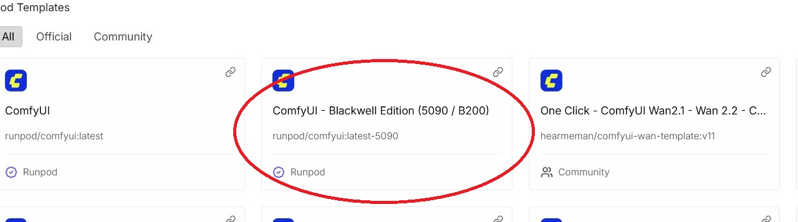

# Provisioning Scripts for ComfyUI on Slim Docker Environments

This repository contains a curated collection of shell scripts (`.sh`) designed to automatically provision and set up specific models and custom nodes within a specific ComfyUI container image.  

These scripts are optimized for performance by leveraging multi-connection downloads (`aria2c`).  The Nunchaku scripts are now configured to use official, pre-built binaries for faster setup.  

## Quickstart

> [!TIP]
> **New to RunPod?** If you are brand new to the platform and want an illustrated, step-by-step guide on how to get everything running from scratch using the Wan 2.1 5B script as an example, click [here](./TUTORIAL.md).  

* **Template Selection:** We recommend choosing the **"ComfyUI - Blackwell Edition (5090 / B200)"** template (`runpod/comfyui:latest-5090`).  Please note that the "5090 / B200" designation simply means the image has been updated to support these newer GPUs—it does **not** mean they are the minimum requirement.  These scripts also fully support the `madiator2011/better-comfyui:slim-5090` image.  



* **Launch Pod:** Wait for the container to finish its minutes-long setup.  
* **Open Terminal:** Open a shell using Zasper (the Jupyter clone this image ships with), SSH, or `exec -it bash`.  
* **Run Script:** Run a script from the selection available that corresponds with your intended workflow, eg:  
  ```bash
  curl -s https://raw.githubusercontent.com/FNGarvin/provisioning/main/fastwan-5b.sh | bash
  ```
* **Wait & Launch:** Wait for the script to complete, then open the ComfyUI app with your browser and choose a suitable template.  

## 📜 Script Index

Scripts are divided into core architectures and optional add-ons.  

### Core Provisioning Scripts (Base Architectures)

These scripts install models and custom nodes for a functional core environment.  Please be aware that the Nunchaku optimizations are exclusive to NVidia GPUs and the superior FP4 models are exclusive to RTX5xxx series GPUs.  

| Filename | Architecture | Focus | Target GPU | Key Actions |
| :--- | :--- | :--- | :--- | :--- |
| `fastwan-5b.sh` | **Wan 2.2** | FP16/Safetensors | 16GB+ VRAM | Installs Wan 2.2 5B models and the FastWan-MovieGen custom node. |
| `fastwan-5b-8gb.sh` | **Wan 2.2** | GGUF Q3\_K\_S | Tested on 8GB VRAM | Installs GGUF-quantized models for tight VRAM constraints. |
| `fastwan-5b-12gb.sh`| **Wan 2.2** | GGUF Q6\_K | Tested on 12GB VRAM | Installs intermediate-quality GGUF-quantized models. |
| `qwen.sh`| **Qwen-Image** | Base GGUF | Tested on 12GB VRAM | Installs Q4 Qwen-Image GGUF with ComfyUI-GGUF node. |
| `flux_nunchaku_fp4.sh`| **FLUX.1** | Nunchaku FP4 | REQUIRES RTX 5XXX Series | Installs core FLUX models and installs Nunchaku for FP4 acceleration. |
| `flux_nunchaku_int4.sh`| **FLUX.1** | Nunchaku INT4 | GTX 1660 Ti and newer | Installs core FLUX models and installs Nunchaku for INT4 acceleration. |
| `qwen_nunchaku_fp4.sh`| **Qwen-Image** | Nunchaku FP4 + GGUF | REQUIRES RTX 5XXX Series | Installs Qwen Nunchaku model with FP4 acceleration. |
| `qwen_nunchaku_int4.sh`| **Qwen-Image** | Nunchaku INT4 + GGUF | GTX 1660 Ti and newer | Installs Qwen Nunchaku model pairing with Q4 GGUF text encoder. |
| `flux2.sh`| **FLUX.2** | FP8/Safetensors | 16GB+ VRAM | Installs FLUX.2 models (Text Encoder, Diffusion Model, VAE). |

### Add-on Provisioning Scripts (Optional Models)

These scripts, located in the `addons` subdirectory, download optional diffuser models intended for pairing with one of the core scripts above.  Run like this:  
```bash
curl -s https://raw.githubusercontent.com/FNGarvin/provisioning/main/addons/nunchaku_krea_int4.sh | bash
```

| Filename | Architecture | Focus | Complementary Script |
| :--- | :--- | :--- | :--- |
| `qwen-edit.sh` | Qwen-Image-Edit-2509 | Base GGUF model. | `qwen.sh` |
| `nunchaku_qwen-edit_fp4.sh`| Qwen-Image-Edit-2509 | Nunchaku FP4 model. | `qwen_nunchaku_fp4.sh` |
| `nunchaku_qwen-edit_int4.sh`| Qwen-Image-Edit-2509 | Nunchaku INT4 model. | `qwen_nunchaku_int4.sh` |
| `nunchaku_kontext_fp4.sh`| FLUX.1 | Nunchaku FP4 model. | `flux_nunchaku_fp4.sh` |
| `nunchaku_kontext_int4.sh`| FLUX.1 | Nunchaku INT4 model. | `flux_nunchaku_int4.sh` |
| `nunchaku_krea_fp4.sh` | FLUX.1 | Nunchaku FP4 model. | `flux_nunchaku_fp4.sh` |
| `nunchaku_krea_int4.sh`| FLUX.1 | Nunchaku INT4 model. | `flux_nunchaku_int4.sh` |

## ⚠️ Current Known Issues and Workarounds

### ComfyUI LORA Loader Crash (Temporary Fix)

A recent upstream ComfyUI commit introduced a bug that causes a crash when loading LORAs, particularly when using Nunchaku.  This issue is logged as [GitHub issue #710](https://github.com/nunchaku-tech/ComfyUI-nunchaku/issues/710).  

* **Workaround:** All Nunchaku provisioning scripts now include a hack that comments out the problematic lines of code in `comfy/supported_models_base.py`.  
* **Post-Fix Behavior:** For reliable LORA swapping, you may still need to click the "Unload all models" button on the toolbar before switching the LORA.  

## ⚖️ Licensing

* **CC BY-NC 4.0:** The three **`fastwan-5b*`** provisioning scripts retain their original **CC BY-NC 4.0** license.  
* **Apache License 2.0:** Nunchaku is copyright Han Labs and licensed under the terms of the Apache License.  
* **Public Domain:** All other scripts are released into the **Public Domain**.
