# Step-by-Step Provisioning Guide for RunPod

If you are new to RunPod or cloud-based GPUs, this guide will walk you through the entire process of setting up a pod and running these provisioning scripts.  This specific walkthrough demonstrates the **Wan 2.2 5B FastWan distillation**, which provides high-quality 720p text-to-video (and mediocre image-to-video) at impressive speeds, but ComfyUI is capable of so much more.  For some other provisioning scripts, look [here](./README.md).  Or, once you become comfortable with downloading and using arbitrary models, browse through the many available templates inside ComfyUI or on [CivitAI](https://civitai.com/) and pick out something you'd like to try.  

---

## 1. Account Setup and Funding
Before you can deploy a GPU, you must create a RunPod account.  Once registered, navigate to the **Billing** section.  RunPod operates on a pay-as-you-go model; you will need to top up your account with a minimum of $10 to begin.  For this tutorial, we are using an **RTX 3090** on the Community Cloud, which typically costs less than **$0.25/hr**.  RunPod bills to the nearest second, so your actual cost for a short testing session will be just a few cents.  

## 2. Select Your Base Template
Navigate to the **Templates** or **GPU Selection** screen.  For these scripts, we recommend starting with a high-performance base.  
* **Template Choice:** Selecting the default RunPod ComfyUI template works well.  In this example, we are using the **ComfyUI - Blackwell Edition (5090 / B200)** as a robust starting point (the 5090 / B200 in the title merely indicates that it's updated to support these GPUs, not that they are the minimum requirement).  


## 3. Configure Storage and Overrides
To ensure the model weights have enough room and to keep costs down, you need to adjust the disk settings.  
* **Volume Disk:** Set this to **0**.  This is temporary storage for general testing and prevents you from being billed for storage after the pod is terminated.  
* **Container Disk:** Increase this to **150 GB**.  The model weights for Wan 2.2 are large and require plenty of space.  
* Click **Set Overrides** to confirm these changes.  

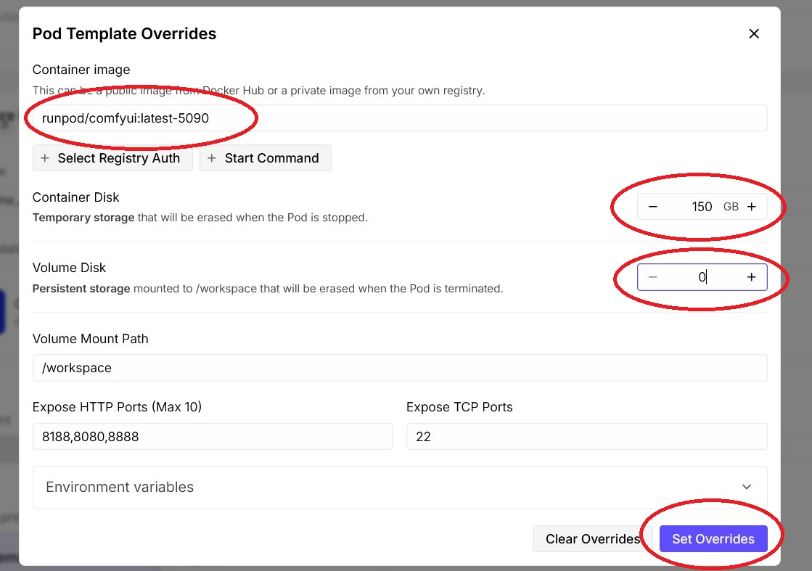

## 4. Review Deployment Parameters
Perform a final sanity check on your pod summary.  Ensure the template listed is correct.  Verify that you have a GPU with at least 16 GB of VRAM (for the "full-fat" version of this script, a 16 GB+ card like the 3090 is required).  Confirm that the "Stopped Pod disk cost" is **$0.00/hr**.  Once ready, hit the large **Deploy** button at the bottom of the screen.  

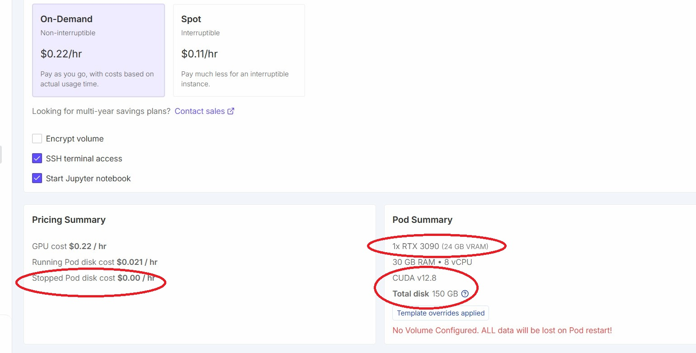

## 5. Monitor the Boot Process
After deployment, click on your pod in the "My Pods" list to expand the menu.  
* **System Logs:** Click the **Logs** tab and then the **System** button.  Wait until you see the image load and the "start container" sequence begin.  

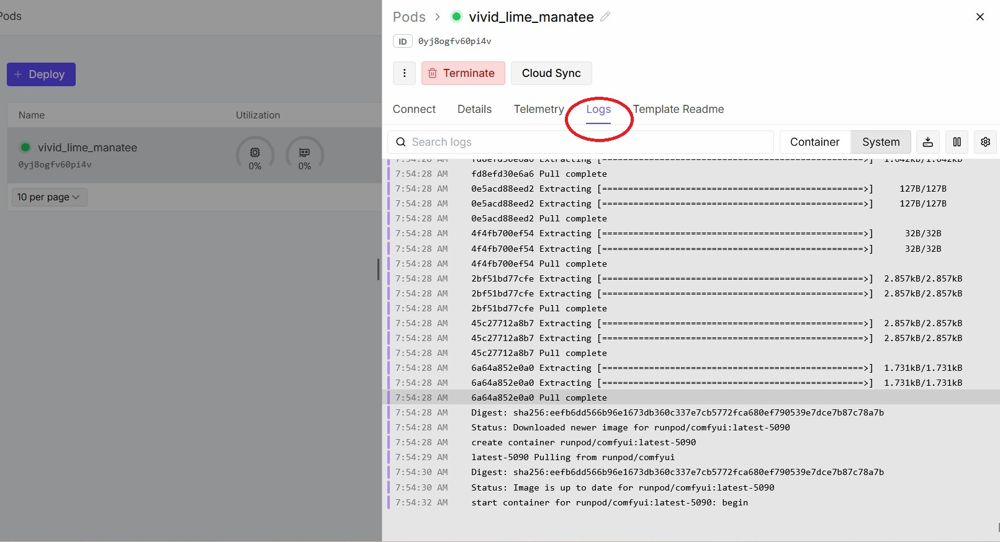

* **Container Logs:** Switch to the **Container** button.  Wait until the logs indicate that "All startup tasks have been completed."  

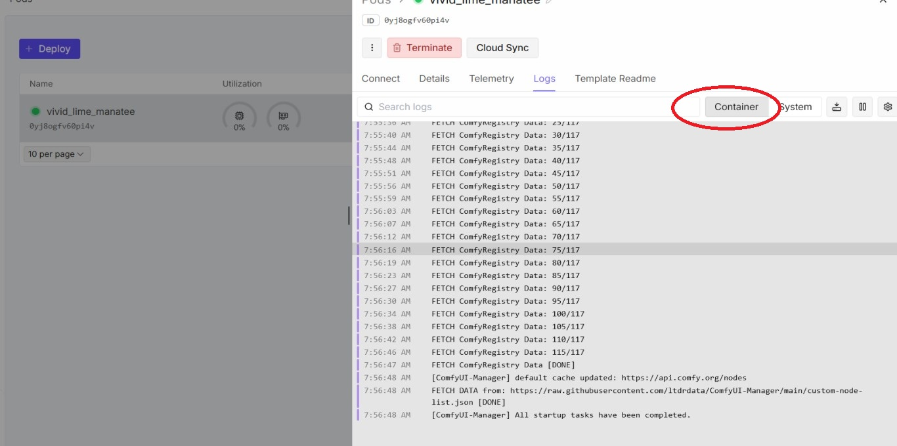

## 6. Open the Terminal
Go to the **Connect** tab.  Click on **Connect to JupyterLab**.  Once Jupyter opens, find the "Other" section at the bottom of the launcher and click the **Terminal** icon.  

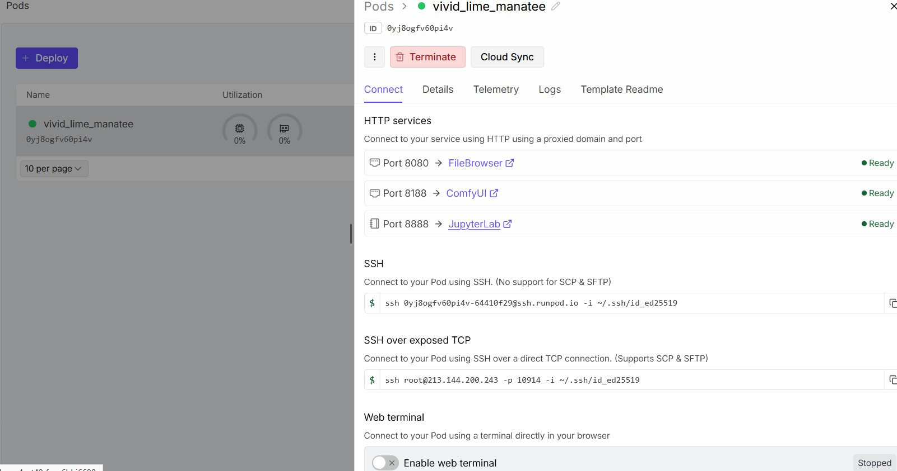
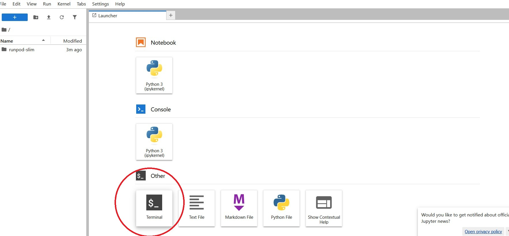

## 7. Run the Provisioning Script
Copy the curl command for the FastWan 5B script from the main repository.  In the Jupyter terminal, right-click and choose **Paste**, then hit **Enter**.  

```bash
curl -s https://raw.githubusercontent.com/FNGarvin/provisioning/main/fastwan-5b.sh | bash
```

The script will automatically download the necessary model weights, LoRAs, and custom nodes.  

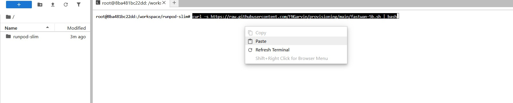

## 8. Launch ComfyUI
Once the terminal displays `Provisioning complete` or something similar, return to your RunPod dashboard browser tab.  Go back to the **Connect** tab (the same place you found the Jupyter link) and click the link for **Port 8188 (ComfyUI)**.  

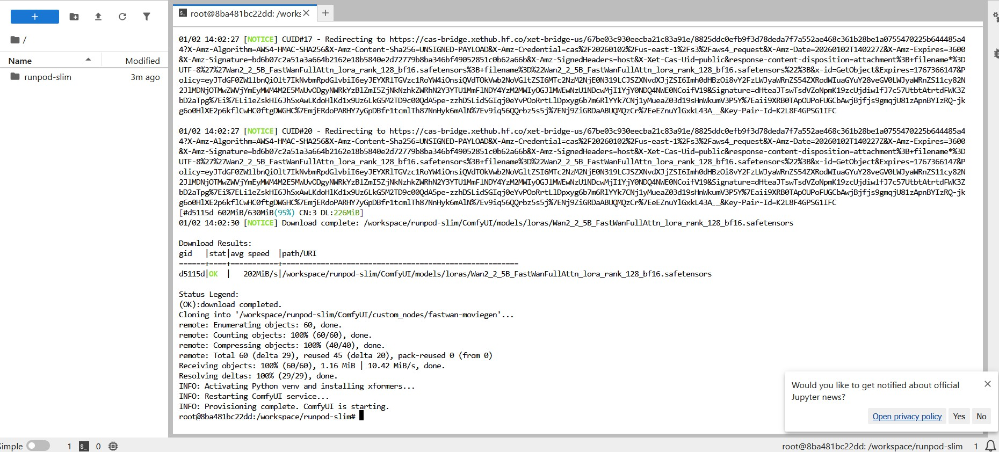


## 9. Select Template and Prompt
When ComfyUI opens, you may see a yellow alert regarding a front-end mismatch or other warnings.  Simply click the **X** to dismiss it.  

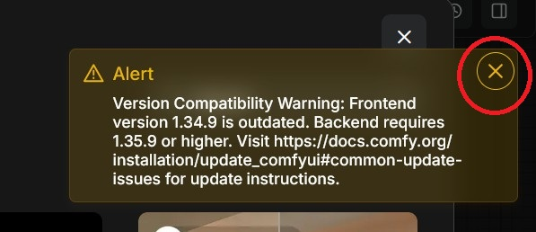

1. Click the **Templates** button in the ComfyUI sidebar if the template selection dialog is not already up.  
2. Select the template appropriate for your script (in this case, **FastWan-Simple**).  
3. **Prompting:** Enter your text prompt.  
4. **Image-to-Video (Optional):** If you wish to use an image as input, click the **Load Image** node and press `Ctrl+B` (or right-click and choose "Enable") to activate it, and upload your file.  
5. Hit **Run**.  

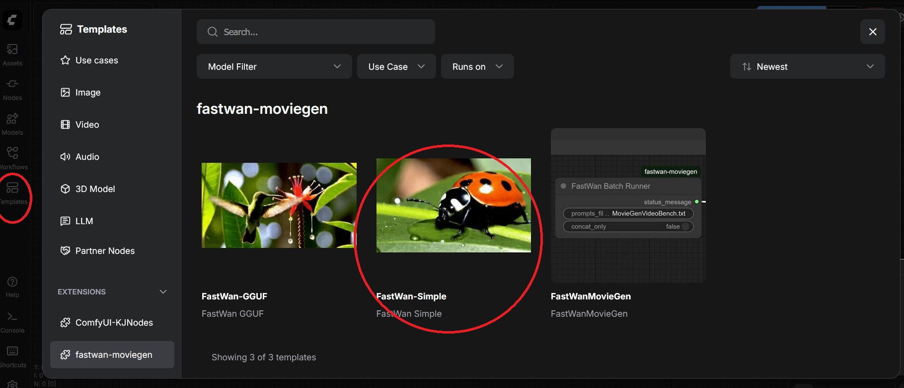
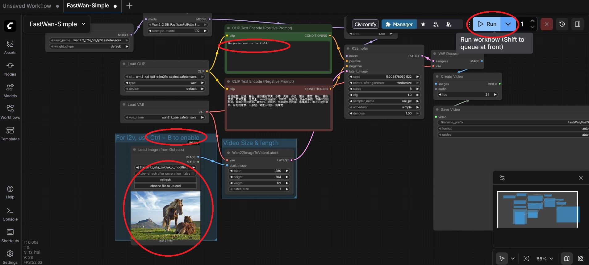

## 10. Results and Saving
On an RTX 3090, a five-second video at 24fps typically takes between **110 to 120 seconds** to generate.  Once the process is complete, right-click the output video and select **Save Video As...** if you wish to download your work.  

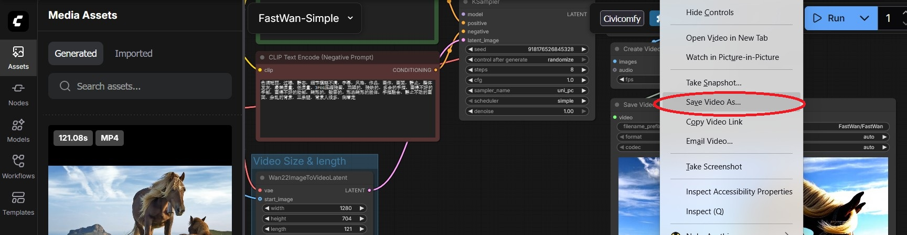

### Completed Demo
Below is a preview of the output.  Please note that the animated GIF is compressed for web viewing; the actual generated MP4 file has significantly higher fidelity and smoother motion.  

  
[Download the high-quality MP4 here](./images/horses.mp4)

---

### Important: Cleaning Up
When you are finished with your session, remember to **Terminate** your pod from the RunPod dashboard.  It's the red button seen below:


